# Hangout

> Peer-to-peer video calling with real-time chat, in-call notes, screen sharing, and meeting recordings — no plugins required.


---

## Table of Contents

- [Features](#features)
- [Tech Stack](#tech-stack)
- [Folder Structure](#folder-structure)
- [Setup & Installation](#setup--installation)
- [Environment Variables](#environment-variables)
- [Architecture](#architecture)
  - [System Architecture Diagram](#system-architecture-diagram)
  - [Connection Reference](#connection-reference)
  - [WebSocket Signal Message Types](#websocket-signal-message-types)
  - [Key Design Decisions](#key-design-decisions)
- [Application Flow](#application-flow)
  - [Sign-Up Flow](#1-sign-up-flow)
  - [Sign-In Flow with Lockout](#2-sign-in-flow-with-lockout)
  - [Home Dashboard Load](#3-home-dashboard-load)
  - [Starting an Instant Meeting](#4-starting-an-instant-meeting)
  - [Joining via Room Code](#5-joining-via-room-code)
  - [WebRTC Connection Establishment](#6-webrtc-connection-establishment-multi-user)
  - [In-Call Actions](#7-in-call-actions)
  - [Meeting Recording](#8-meeting-recording)
  - [Screen Sharing](#9-screen-sharing)
  - [Leaving a Call](#10-leaving-a-call)
  - [Recording & Notes Dashboard](#11-recording--notes-management-on-dashboard)
- [Database Schema](#database-schema)
  - [ER Diagram](#entity-relationship-diagram)
  - [Model Reference](#model-reference)
  - [REST API Endpoints](#rest-api-endpoints)
- [File Guide](#file-guide)
  - [Frontend](#frontend)
  - [Backend](#backend)
- [Authors](#authors)

---

## Features

The following features are implemented and confirmed from source code:

| Feature | Details |
|---|---|
| **Instant meetings** | One click generates a random 7-character room ID |
| **Join by room code** | Paste or type a code to join any existing room |
| **Pre-join screen** | Camera and microphone permission toggles before entering a call |
| **Multi-user video grid** | Responsive CSS grid that auto-adjusts layout for 1–9+ participants |
| **Mic toggle** | Enables/disables the local audio track without dropping the peer connection |
| **Camera toggle** | Enables/disables the local video track; dynamically requests permission on first use |
| **Screen sharing** | Full `getDisplayMedia` screen share with automatic layout switch to presenter+sidebar view; max bitrate set to 5 Mbps |
| **Video filters** | Six CSS-class-based filters (Normal, Warm Sepia, Mono Black, Cyber X-Ray, Soft Focus, Neon Pop) broadcast to peers |
| **In-call chat** | Text messages sent over the WebSocket signaling channel and rendered in real time |
| **In-call notes panel** | Freeform text editor with copy and save-to-server actions |
| **Music streaming** | Shares a local audio file or system audio (from Spotify / YouTube Music tab) as a peer track |
| **Meeting recording** | Canvas-based composite recorder (VP9/VP8/WebM) that captures all video tiles + audio; auto-uploads to Cloudinary via the backend on stop |
| **Recording playback** | Recordings stored per-user in Cloudinary; playable directly from the Home dashboard |
| **15-day recording expiry** | Server-side automatic cleanup of files (from Cloudinary) and rows older than 15 days |
| **Saved notes history** | Notes persisted to the database; viewable, copyable, and deletable from the Home dashboard |
| **Authentication** | Username/email + password sign-up and sign-in via Django's built-in auth |
| **Brute-force lockout** | Progressive account lockout: 1 min after 5 fails, 10 min after 6, 30 min after 7+ |
| **Live weather widget** | Geolocation-based weather on the dashboard using Open-Meteo and BigDataCloud APIs |
| **Animated preloader** | Multilingual greeting animation on first login, built with Framer Motion |
| **Shader gradient backgrounds** | WebGL animated gradient on the landing and auth pages via `@shadergradient/react` |

---

## Tech Stack

### Frontend

| Package | Version | Role |
|---|---|---|
| `react` | ^19.2.4 | UI framework |
| `react-dom` | ^19.2.4 | DOM renderer |
| `react-router-dom` | ^7.14.0 | Client-side routing |
| `axios` | (peer dependency used in pages) | HTTP client for REST API calls |
| `tailwindcss` | ^4.2.2 | Utility-first CSS |
| `@tailwindcss/vite` | ^4.2.2 | Vite integration for Tailwind v4 |
| `framer-motion` | ^12.38.0 | Preloader animation |
| `@shadergradient/react` | ^2.4.20 | Animated WebGL shader backgrounds |
| `three` | ^0.184.0 | 3D engine (used by shader gradient) |
| `three-stdlib` | ^2.36.1 | Three.js utilities |
| `@react-three/fiber` | ^9.6.1 | React renderer for Three.js |
| `camera-controls` | ^3.1.2 | Camera controls for Three.js scenes |
| `cobe` | ^2.0.1 | Globe animation (in package.json; direct usage in pages unclear) |
| `lucide-react` | ^1.21.0 | Icon set |
| `@radix-ui/react-dialog` | ^1.1.17 | Accessible dialog primitive |
| `@radix-ui/react-slot` | ^1.3.0 | Slot primitive for `Button` component |
| `class-variance-authority` | ^0.7.1 | Variant-based class generation for `Button` |
| `clsx` + `tailwind-merge` | ^2.1.1 / ^3.6.0 | Conditional class name merging |
| `styled-components` | ^6.4.1 | CSS-in-JS (in package.json; direct usage in source not confirmed) |
| `vite` | ^8.0.1 | Build tool / dev server |
| `@vitejs/plugin-react` | ^6.0.1 | React Fast Refresh for Vite |
| `@playwright/test` | ^1.61.1 | End-to-end testing framework |

> **WebRTC:** Uses the native browser `RTCPeerConnection`, `MediaStream`, and `MediaRecorder` APIs directly — no third-party WebRTC SDK.  
> **Signaling:** Native browser `WebSocket` API connecting to Django Channels.

### Backend

| Package | Version | Role |
|---|---|---|
| `Django` | 6.0.6 | Web framework + ORM + auth |
| `djangorestframework` | 3.17.1 | REST API views and serializers |
| `channels` | 4.3.2 | ASGI WebSocket support |
| `daphne` | (listed in `INSTALLED_APPS`) | ASGI server |
| `django-cors-headers` | (listed in `INSTALLED_APPS`) | CORS middleware |

> **Database:** Neon Serverless Postgres  
> **Channel Layer:** `InMemoryChannelLayer` — single-server only; replace with Redis for multi-process deployment  
> **Media storage:** Cloudinary via `django-cloudinary-storage`

---

## Folder Structure

```
hangout/
├── README.md                        # ← you are here
├── # Saved Notes Implementation.txt # Developer scratchpad
│
└── hangout/
    ├── package.json                 # Root workspace package (minimal)
    ├── patch_call.py                # Utility/patch script
    │
    ├── backend/                     # Django project root
    │   ├── manage.py                # Django CLI entrypoint
    │   ├── requirements.txt         # Python dependencies
    │   ├── db.sqlite3               # SQLite database (auto-created)
    │   ├── media/                   # Uploaded recording files (auto-created)
    │   │
    │   ├── core/                    # Django project config package
    │   │   ├── settings.py          # Global settings (DB, apps, CORS, channels)
    │   │   ├── urls.py              # Root HTTP URL routing
    │   │   ├── asgi.py              # ASGI entry: routes HTTP + WebSocket
    │   │   └── wsgi.py              # WSGI entry (legacy / fallback)
    │   │
    │   ├── users/                   # Auth Django app
    │   │   ├── models.py            # SignupUser, LoginAttempt models
    │   │   ├── views.py             # signup / signin API views
    │   │   ├── serializers.py       # UserSerializer (DRF)
    │   │   ├── urls.py              # /api/signup/, /api/signin/
    │   │   └── admin.py             # Admin registration for SignupUser
    │   │
    │   └── meetings/                # Rooms, recordings, notes, WebSocket app
    │       ├── models.py            # Room, MeetingRecording, MeetingNote models
    │       ├── views.py             # REST endpoints for recordings & notes
    │       ├── consumers.py         # WebSocket consumer (WebRTC signaling)
    │       └── routing.py           # WebSocket URL patterns
    │
    └── frontend/                    # Vite + React SPA
        ├── index.html               # HTML shell
        ├── vite.config.js           # Vite config (React + Tailwind plugins)
        ├── package.json             # Frontend dependencies
        ├── eslint.config.js         # ESLint rules
        ├── jsconfig.json            # Editor path resolution
        ├── e2e-test.spec.js         # Full flow E2E test (signup → call → chat)
        ├── join_call.spec.js        # Join-call E2E test
        ├── multi_join.spec.js       # Multi-user join E2E test
        │
        └── src/
            ├── main.jsx             # React root mount point
            ├── App.jsx              # Router and route definitions
            ├── index.css            # Global styles + Tailwind import + font loading
            │
            ├── pages/
            │   ├── Landing.jsx      # Landing page with shader gradient
            │   ├── sign_up.jsx      # Registration form
            │   ├── sign_in.jsx      # Login form with lockout countdown
            │   ├── Home.jsx         # Post-login dashboard
            │   ├── Home.css         # Neomorphic design system tokens + classes
            │   ├── Call.jsx         # Full in-call interface (WebRTC engine)
            │   └── About.jsx        # About page with team info
            │
            ├── components/
            │   ├── Preloader.jsx    # Animated multilingual preloader
            │   ├── WeatherCard.jsx  # Live weather widget
            │   └── ui/
            │       ├── button.jsx   # CVA-based Button component
            │       └── dialog.tsx   # Radix UI Dialog wrapper
            │
            └── lib/
                └── utils.js         # cn() helper (clsx + tailwind-merge)
```

---

## Setup & Installation

### Prerequisites

- **Python** 3.10+
- **Node.js** 18+ and **npm** 9+
- A modern Chromium-based browser (for WebRTC `getDisplayMedia` and `MediaRecorder`)

### Backend

```bash
cd hangout/backend

# Create and activate virtual environment
python -m venv venv
# Windows
venv\Scripts\activate
# macOS / Linux
source venv/bin/activate

# Install Python dependencies
pip install -r requirements.txt
# Note: django-cors-headers and daphne are not in requirements.txt — install manually:
pip install django-cors-headers daphne

# Apply database migrations
python manage.py migrate

# Start the ASGI development server
python manage.py runserver
```

The backend will be available at `http://127.0.0.1:8000`.

### Frontend

```bash
cd hangout/frontend

# Install Node dependencies
npm install

# Start the Vite dev server
npm run dev
```

The frontend will be available at `http://localhost:5173`.

### Running E2E Tests

With both servers running:

```bash
cd hangout/frontend
npx playwright test e2e-test.spec.js
```

---

## Environment Variables

There is no `.env` file or `.env.example` in this repository. All configuration is currently hardcoded:

| Setting | Location | Current Value |
|---|---|---|
| Backend API base URL | `sign_in.jsx`, `sign_up.jsx`, `Home.jsx`, `Call.jsx`, `utils.js` | Render Backend URL or `http://127.0.0.1:8000` |
| WebSocket URL | `Call.jsx` | `ws://localhost:8000/ws/call/{roomId}/` |
| Django `SECRET_KEY` | `core/settings.py` | Hardcoded (insecure for production) |
| Django `DEBUG` | `core/settings.py` | `True` |
| Django `ALLOWED_HOSTS` | `core/settings.py` | `[]` (localhost only) |
| CORS policy | `core/settings.py` | `CORS_ALLOW_ALL_ORIGINS = True` |
| Channel layer | `core/settings.py` | `InMemoryChannelLayer` |
| Weather fallback coords | `WeatherCard.jsx` | Kolkata, India (22.5726, 88.3639) |

> **For production:** Extract these into environment variables, replace `SECRET_KEY`, set `DEBUG = False`, configure `ALLOWED_HOSTS`, and replace `InMemoryChannelLayer` with `channels_redis`.

---

## Architecture

This section describes how each layer of the system connects, what protocol each connection uses, and where state lives.

### System Architecture Diagram

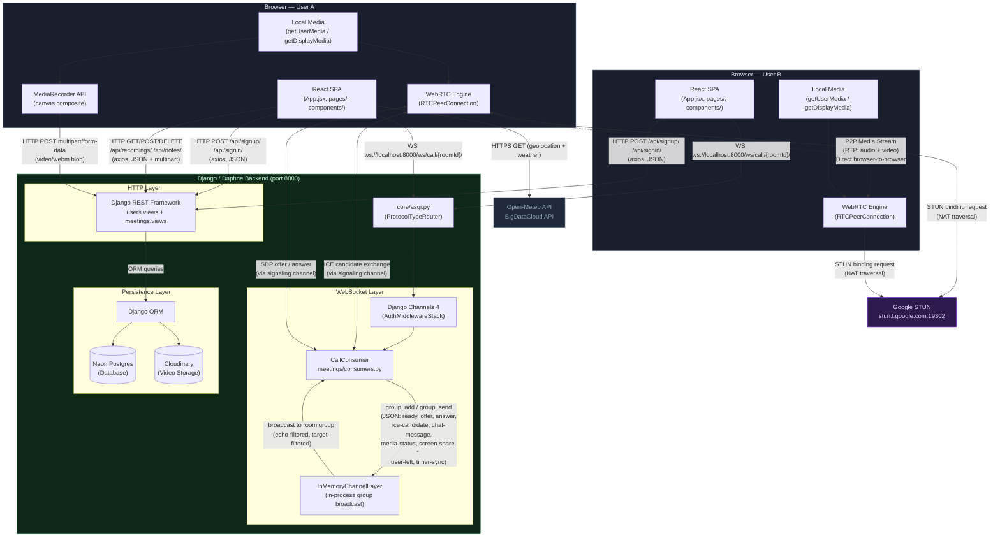

### Connection Reference

| Connection | Protocol | Direction | Payload |
|---|---|---|---|
| React → Django REST | HTTP/1.1 (axios) | Request/Response | JSON; multipart/form-data for recording uploads |
| React → Django WebSocket | WebSocket (`ws://`) | Bidirectional | JSON signal messages |
| Django → Django (intra-server) | `InMemoryChannelLayer` | Broadcast within process | Python dicts via `group_send` |
| Browser A ↔ Browser B | WebRTC RTP/DTLS | Peer-to-peer | Audio + video media frames; SRTP encrypted |
| Browser → STUN | UDP (STUN protocol) | Request/Response | Binding request for public IP/port discovery |
| `WeatherCard` → External APIs | HTTPS (fetch) | Request/Response | JSON weather data |

### WebSocket Signal Message Types

Every message flowing through the signaling server (`CallConsumer`) is a JSON object with at minimum a `type` and `sender` field. The consumer echo-filters (drops messages back to the sender) and optionally target-filters (drops messages not addressed to `target`).

| `type` | Direction | Purpose |
|---|---|---|
| `ready` | Client → Server → Peers | Announces a new participant; triggers `initializePeerConnection` as caller |
| `request-state` | Client → Server → Peers | Asks existing participants to resend their current state |
| `offer` | Client → Server → Target | SDP offer from the calling peer |
| `answer` | Client → Server → Target | SDP answer from the receiving peer |
| `ice-candidate` | Client → Server → Target | ICE candidate for NAT traversal |
| `media-status` | Client → Server → Peers | Broadcasts current `isMicOn` / `isCameraOn` state |
| `screen-share-start` | Client → Server → Peers | Notifies peers that screen sharing started |
| `screen-share-stop` | Client → Server → Peers | Notifies peers that screen sharing stopped |
| `timer-sync` | Client → Server → Target | Synchronises call start timestamp across joining peers |
| `chat-message` | Client → Server → Peers | In-call chat text message |
| `change-filter` | Client → Server → Peers | Broadcasts the sender's selected CSS video filter |
| `music-status` | Client → Server → Peers | Notifies peers that music sharing started/stopped |
| `user-left` | Server → Peers | Sent by `CallConsumer.disconnect` when a WebSocket closes |

### Key Design Decisions

**Full Mesh Topology** — Each client maintains a direct `RTCPeerConnection` to every other participant. O(n²) connections, appropriate for small meeting rooms, avoids a media server.

**Signaling Server as Pure Relay** — `CallConsumer` does not inspect or interpret SDP/ICE payloads. It only routes, echo-filters, and target-filters messages.

**ICE Candidate Queuing** — Because ICE candidates can arrive before `setRemoteDescription` completes, `Call.jsx` maintains an `iceCandidateQueue` keyed by sender username. Queued candidates are flushed once the remote description is set.

**Canvas-Based Recording** — Instead of recording individual streams, `Call.jsx` creates an offscreen `<canvas>`, draws all video tiles to it at 30 fps using `requestAnimationFrame`, and records the canvas stream with `MediaRecorder`. This produces a single composite file matching the visible layout.

**InMemoryChannelLayer Limitation** — Does not support multi-process or multi-server deployments. For production, replace with `channels_redis.core.RedisChannelLayer`.

---

## Application Flow

Sequence and flowchart diagrams for every core user journey, derived directly from source code.

### 1. Sign-Up Flow

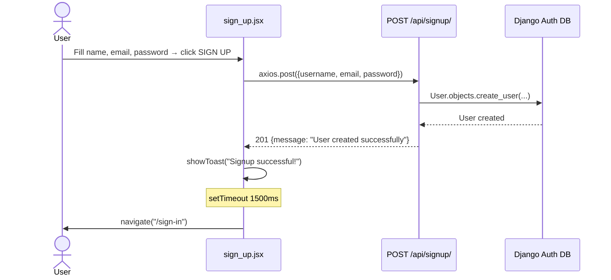

**Error path:** If the username already exists, the API returns `400 {error: "Username already exists"}`.

---

### 2. Sign-In Flow with Lockout

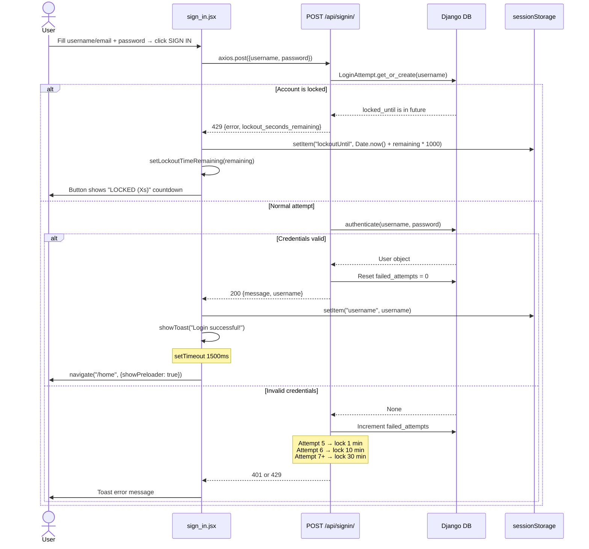

The lockout countdown is persisted in `sessionStorage` as a Unix timestamp so it survives page refreshes. A `setInterval` in `useEffect` ticks down the counter every second.

---

### 3. Home Dashboard Load

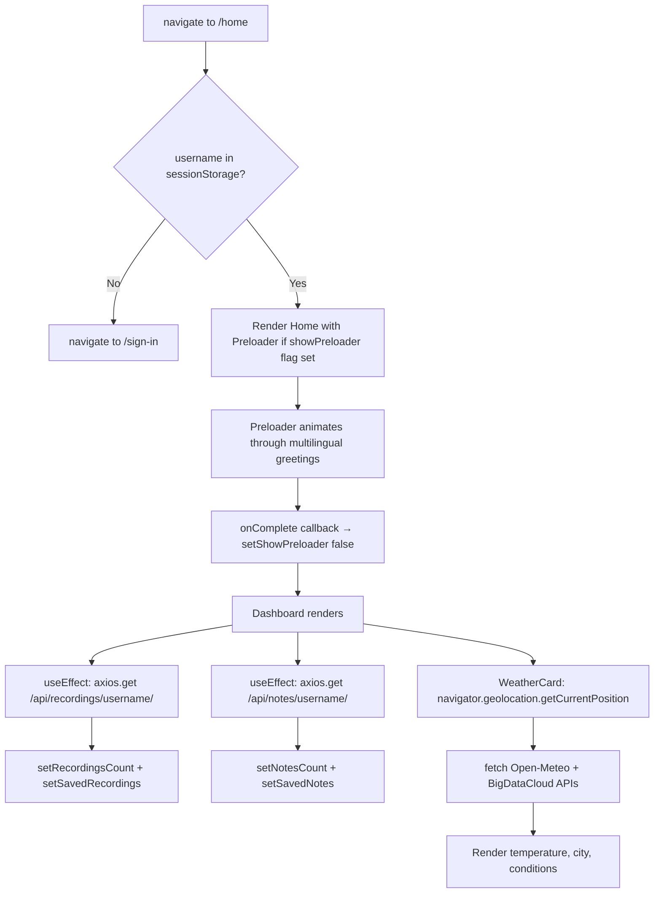

---

### 4. Starting an Instant Meeting

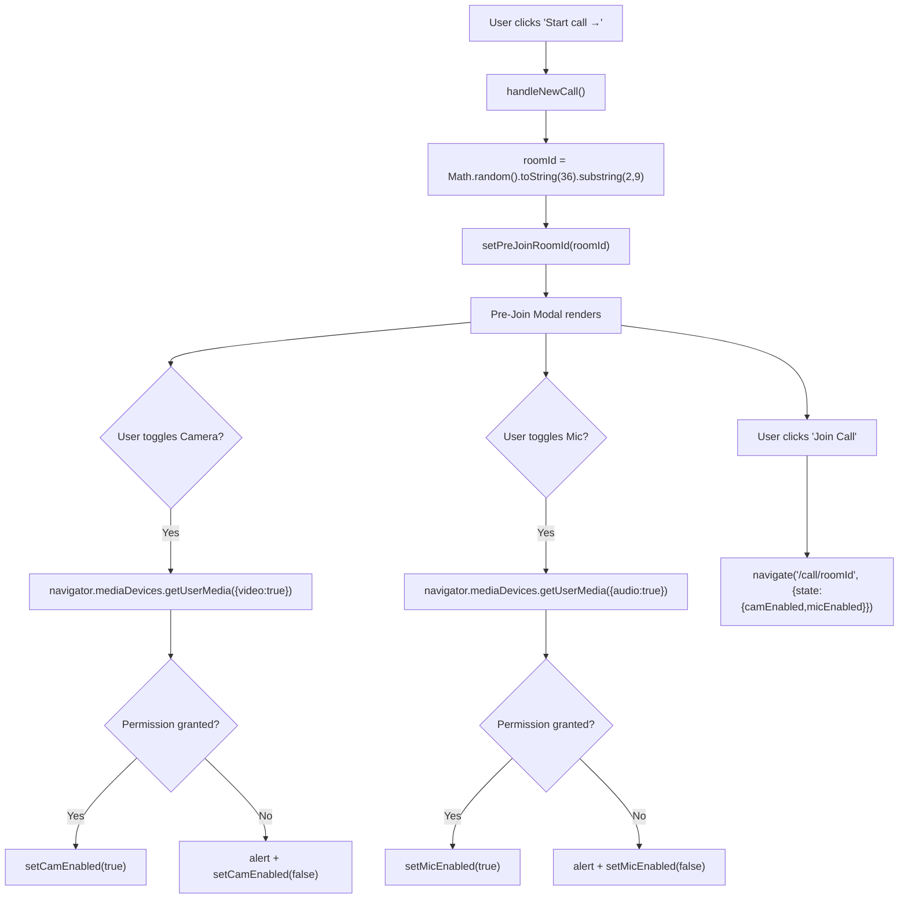

---

### 5. Joining via Room Code

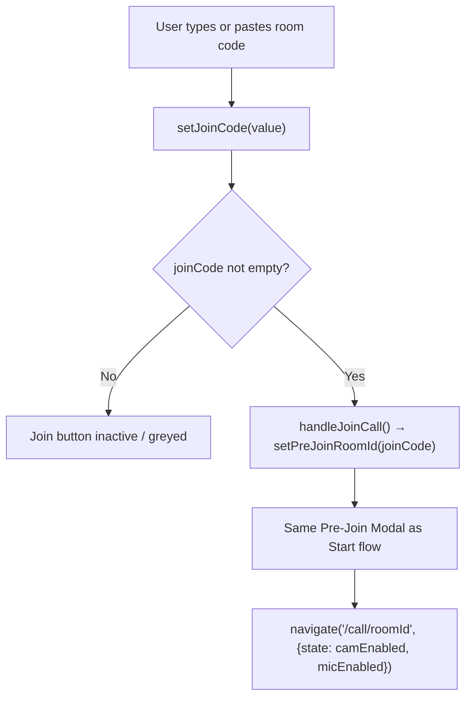

The join input also features a clipboard paste button that calls `navigator.clipboard.readText()`.

---

### 6. WebRTC Connection Establishment (Multi-User)

This sequence shows User B joining a room where User A is already present.

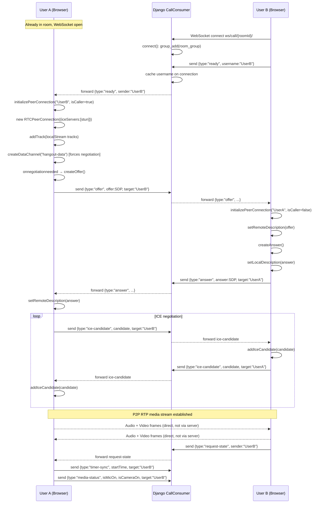

**ICE candidate queuing:** If ICE candidates arrive before `setRemoteDescription` completes, they are pushed to `iceCandidateQueue[sender]` and flushed once the remote description is set.

---

### 7. In-Call Actions

#### Mic / Camera Toggle

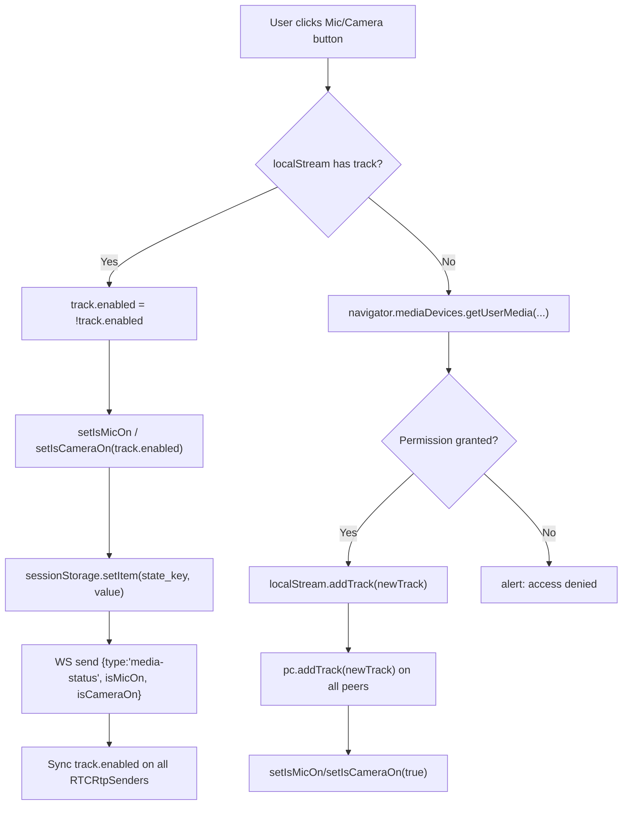

#### Chat Message

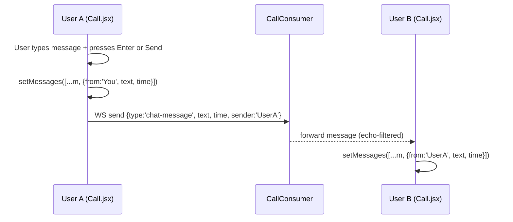

#### Notes Save

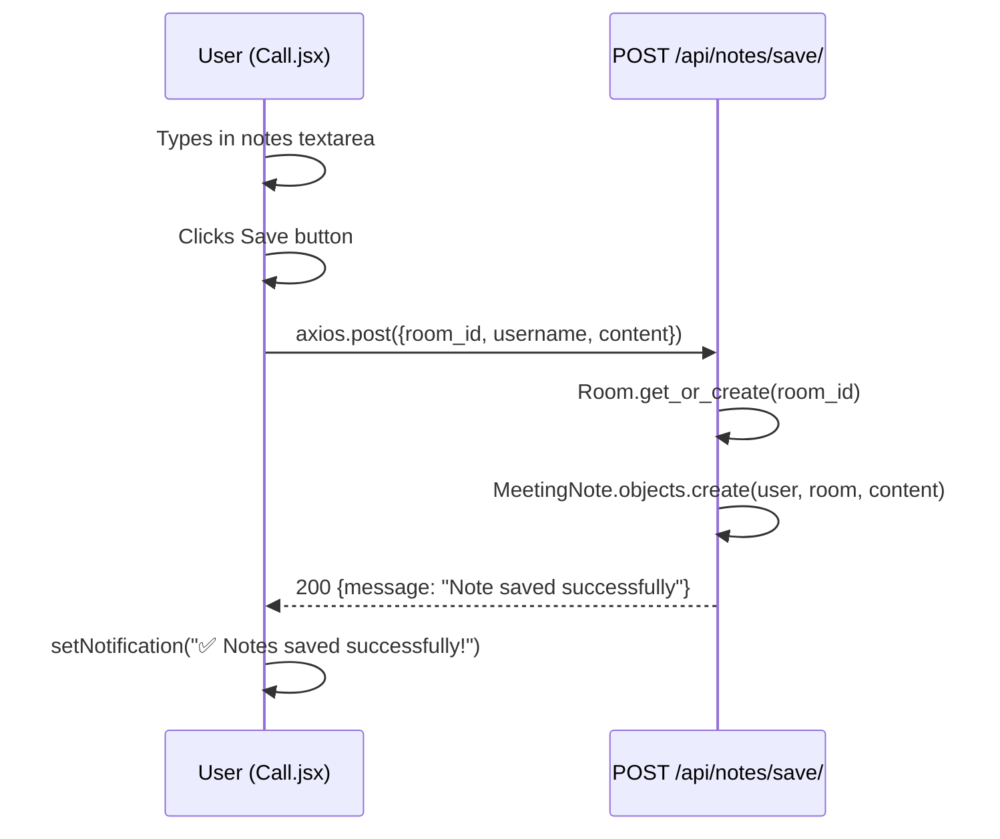

#### Video Filters

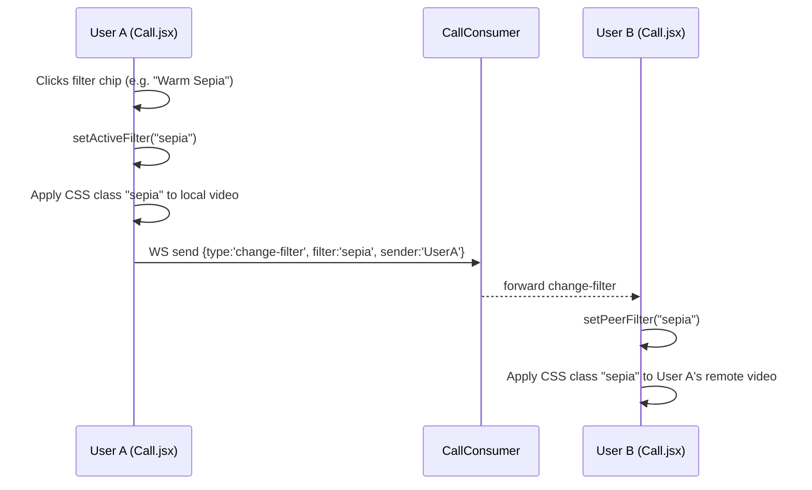

---

### 8. Meeting Recording

```mermaid
sequenceDiagram
    participant User as User (Call.jsx)
    participant Recorder as MediaRecorder API
    participant Canvas as Offscreen Canvas
    participant API as POST /api/recordings/upload/

    User->>User: Clicks Record button (isRecording = false)
    User->>Canvas: createElement('canvas') 1280x720
    User->>Canvas: requestAnimationFrame(drawFrame) loop starts
    Note over Canvas: drawFrame() reads all .stage-video,<br/>.sidebar-video, or .grid-video elements<br/>and paints them to the canvas
    User->>Recorder: canvas.captureStream(30fps) + audio tracks
    User->>Recorder: new MediaRecorder(combinedStream, {mimeType: 'video/webm;codecs=vp9,opus'})
    Recorder->>Recorder: start(1000ms timeslice)
    Recorder->>User: ondataavailable → push to recordedChunks[]
    User->>User: setIsRecording(true)

    User->>User: Clicks Record button again (isRecording = true)
    User->>Recorder: stop()
    Recorder->>User: onstop fires
    User->>Canvas: cancelAnimationFrame() — stop drawing loop
    User->>User: new Blob(recordedChunks, {type:'video/webm'})
    User->>API: axios.post(FormData{video_file, room_id, username})
    API->>API: User.objects.get(username)
    API->>API: Room.get_or_create(room_id)
    API->>API: MeetingRecording.objects.create(user, room, video_file)
    API-->>User: 200 {message: "Upload successful", id}
    User->>User: setNotification("✅ Recording saved!")
```

---

### 9. Screen Sharing

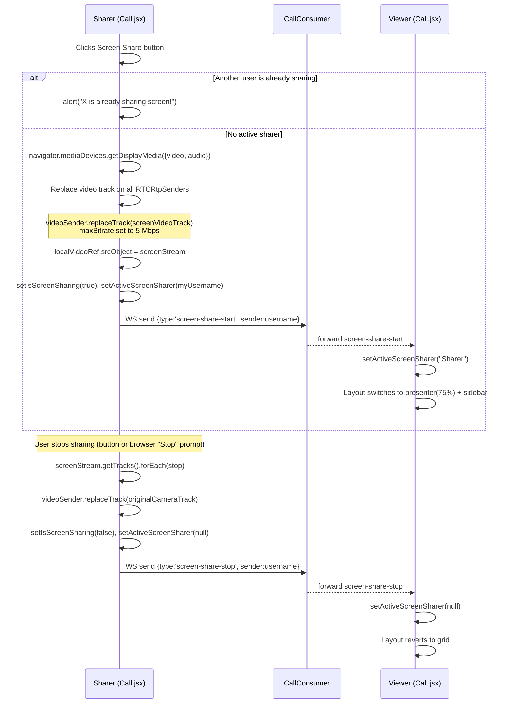

---

### 10. Leaving a Call

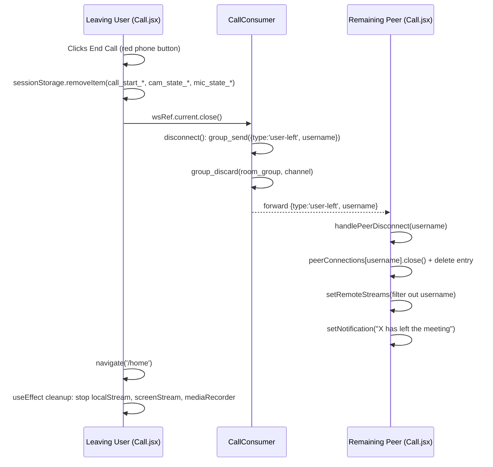

---

### 11. Recording & Notes Management on Dashboard

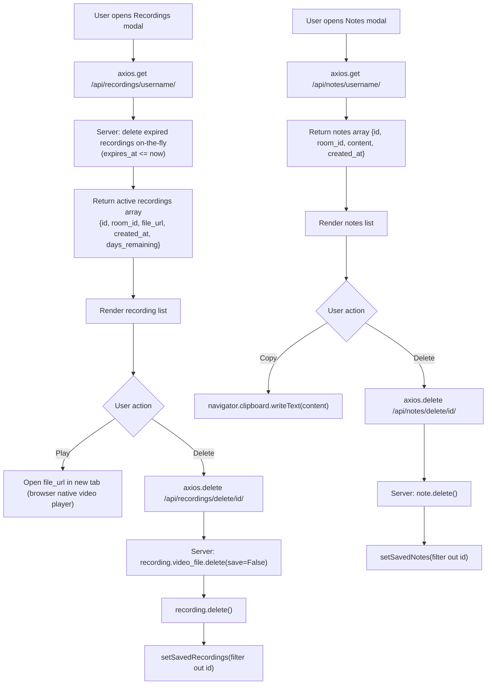

---

## Database Schema

All schema information is derived directly from `users/models.py` and `meetings/models.py`. The project uses SQLite via Django's ORM and Django's built-in `auth.User` model.

### Entity-Relationship Diagram

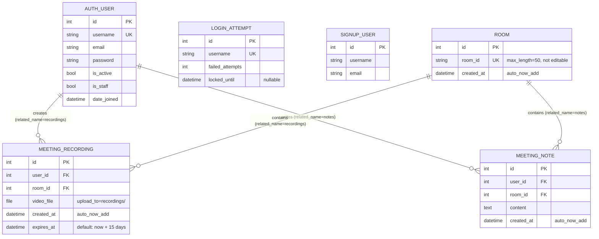

### Model Reference

#### `AUTH_USER` (Django built-in)

Django's built-in `django.contrib.auth.models.User`. FK target for all per-user data.

| Field | Type | Notes |
|---|---|---|
| `id` | AutoField | Primary key |
| `username` | CharField(150) | Unique; application-level user identifier |
| `email` | EmailField | Optional; signin view also accepts email in place of username |
| `password` | CharField | Hashed by Django; write-only in the serializer |

#### `LOGIN_ATTEMPT` (`users/models.py`)

Tracks failed login attempts per username for progressive lockout. Deliberately not a FK to `AUTH_USER` — tracks even non-existent usernames.

| Field | Type | Notes |
|---|---|---|
| `id` | AutoField | Primary key |
| `username` | CharField(100) | **Unique** |
| `failed_attempts` | IntegerField | Default `0` |
| `locked_until` | DateTimeField | `null=True, blank=True` |

**Lockout schedule:**

| `failed_attempts` | Lockout duration |
|---|---|
| 5 | 1 minute |
| 6 | 10 minutes |
| ≥ 7 | 30 minutes |

#### `SIGNUP_USER` (`users/models.py`)

Minimal model stored independently of Django's auth system. Only registered in the admin panel.

> **Note:** The relationship between `SIGNUP_USER` and `AUTH_USER` is ambiguous — both are created independently on sign-up. `SIGNUP_USER` may be a legacy or supplementary model. Needs confirmation.

| Field | Type | Notes |
|---|---|---|
| `id` | AutoField | Primary key |
| `username` | CharField(100) | Not unique |
| `email` | EmailField | — |

#### `ROOM` (`meetings/models.py`)

Represents a meeting room. Created on demand via `get_or_create(room_id=...)`.

| Field | Type | Notes |
|---|---|---|
| `id` | AutoField | Primary key |
| `room_id` | CharField(50) | **Unique**, `editable=False`; holds the short alphanumeric room code |
| `created_at` | DateTimeField | `auto_now_add=True` |

#### `MEETING_RECORDING` (`meetings/models.py`)

Stores a reference to an uploaded video recording file for a specific user and room.

| Field | Type | Notes |
|---|---|---|
| `id` | AutoField | Primary key |
| `user` | ForeignKey → `AUTH_USER` | `on_delete=CASCADE`; `related_name="recordings"` |
| `room` | ForeignKey → `ROOM` | `on_delete=CASCADE`; `related_name="recordings"` |
| `video_file` | FileField | `upload_to="recordings/"` |
| `created_at` | DateTimeField | `auto_now_add=True` |
| `expires_at` | DateTimeField | Default: `now + 15 days` via `fifteen_days_from_now()` |

**Expiry behaviour:** On every `GET /api/recordings/{username}/` call, the view purges rows and files where `expires_at <= now`.

#### `MEETING_NOTE` (`meetings/models.py`)

Stores free-text notes saved by a user during a meeting.

| Field | Type | Notes |
|---|---|---|
| `id` | AutoField | Primary key |
| `user` | ForeignKey → `AUTH_USER` | `on_delete=CASCADE`; `related_name="notes"` |
| `room` | ForeignKey → `ROOM` | `on_delete=CASCADE`; `related_name="notes"` |
| `content` | TextField | Raw note text; no length limit |
| `created_at` | DateTimeField | `auto_now_add=True` |

### REST API Endpoints

#### Auth (`/api/`)

| Method | URL | Handler | Description |
|---|---|---|---|
| `POST` | `/api/signup/` | `users.views.signup` | Create a new `AUTH_USER` |
| `POST` | `/api/signin/` | `users.views.signin` | Authenticate; returns `{username}` on success |

#### Recordings

| Method | URL | Handler | Description |
|---|---|---|---|
| `POST` | `/api/recordings/upload/` | `meetings.views.upload_recording` | Upload a video file; creates `ROOM` if needed |
| `GET` | `/api/recordings/<username>/` | `meetings.views.get_user_recordings` | List recordings; purges expired ones first |
| `DELETE` | `/api/recordings/delete/<id>/` | `meetings.views.delete_recording` | Delete a recording and its file |

#### Notes

| Method | URL | Handler | Description |
|---|---|---|---|
| `POST` | `/api/notes/save/` | `meetings.views.save_note` | Save a note; creates `ROOM` if needed |
| `GET` | `/api/notes/<username>/` | `meetings.views.get_user_notes` | List all notes for a user |
| `DELETE` | `/api/notes/delete/<id>/` | `meetings.views.delete_note` | Delete a note |

#### WebSocket

| Protocol | Pattern | Handler |
|---|---|---|
| WebSocket | `ws/call/<room_id>/` | `meetings.consumers.CallConsumer` |

---

## File Guide

A per-file breakdown of every source file. Grouped by module.

### Frontend

The frontend is a React 19 SPA built with Vite. It lives in `hangout/frontend/`.

---

#### Root Config Files

**`index.html`** — HTML shell with `<div id="root">` and the `<script type="module" src="/src/main.jsx">` entry.

**`vite.config.js`** — Registers `@vitejs/plugin-react` (Fast Refresh) and `@tailwindcss/vite` (Tailwind v4).

**`package.json`** — Project name, version, all npm dependencies, and `dev` / `build` / `lint` / `preview` scripts.

**`eslint.config.js`** — Extends `@eslint/js`, `react-hooks`, and `react-refresh` rule sets.

**`jsconfig.json`** — VS Code path resolution for JavaScript imports.

---

#### `src/main.jsx`

Entry point. Calls `createRoot(document.getElementById('root')).render(<App />)`.  
Imports: `react-dom/client`, `./index.css`, `./App.jsx`.

---

#### `src/App.jsx`

Root router. Wraps the app in `<BrowserRouter>` and defines all routes.

| Path | Component | Notes |
|---|---|---|
| `/` | `<Landing />` | Public |
| `/home` | `<Home />` | Redirects to `/sign-in` if no session |
| `/sign-up` | `<SignUp />` | Public |
| `/sign-in` | `<SignIn />` | Public |
| `/about` | `<About />` | Public |
| `/call/:roomId` | `<Call />` | Dynamic room ID |
| `*` | `<Navigate to="/" />` | 404 fallback |

---

#### `src/index.css`

Loads Google Fonts (`Space Grotesk`, `Inter`, `JetBrains Mono`), imports Tailwind v4 base layer, and defines `.font-display`, `.font-body`, `.font-mono-ui` utility classes.

---

#### `src/pages/Landing.jsx`

**Route:** `/`  
**Purpose:** Public landing page with animated WebGL shader gradient background and a "Get Started" CTA that navigates to `/sign-in`.  
**State:** None (stateless).  
**Imports:** `react`, `@shadergradient/react`, `../components/ui/button`, `react-router-dom`.

---

#### `src/pages/sign_up.jsx`

**Route:** `/sign-up`  
**Purpose:** Registration form. Posts `{username, email, password}` to `POST /api/signup/`. Redirects to `/sign-in` after 1.5s on success.

| State | Type | Purpose |
|---|---|---|
| `formData` | `{username, email, password}` | Controlled form inputs |
| `showPassword` | `boolean` | Toggle password visibility |
| `toast` | `{message, type} \| null` | Ephemeral notification |
| `loading` | `boolean` | Disables submit during request |

**Imports:** `react`, `react-router-dom`, `axios`, `@shadergradient/react`.

---

#### `src/pages/sign_in.jsx`

**Route:** `/sign-in`  
**Purpose:** Login form with brute-force lockout countdown. Posts `{username, password}` to `POST /api/signin/`. On success stores `username` in `sessionStorage` and navigates to `/home`.

| State | Type | Purpose |
|---|---|---|
| `formData` | `{username, password}` | Controlled inputs |
| `showPassword` | `boolean` | Toggle password visibility |
| `toast` | `{message, type} \| null` | Ephemeral notification |
| `loading` | `boolean` | Disables submit during request |
| `lockoutTimeRemaining` | `number` | Countdown seconds; initialised from `sessionStorage.lockoutUntil` |

On 429 response, writes `lockoutUntil = Date.now() + remaining * 1000` to `sessionStorage`. A `setInterval` ticks down the counter each second.

**Imports:** `react`, `react-router-dom`, `axios`, `@shadergradient/react`.

---

#### `src/pages/Home.jsx`

**Route:** `/home`  
**Purpose:** Main post-login dashboard. Manages four modal overlays (recordings, notes, pre-join, logout). Internal `DigitalClock` subcomponent updates every second via `setInterval`.

**State managed:**

| State | Type | Purpose |
|---|---|---|
| `showPreloader` | `boolean` | Triggers `<Preloader>` on navigation from sign-in |
| `joinCode` | `string` | Controlled room code input |
| `showRecordingModal` | `boolean` | Opens recordings history modal |
| `savedRecordings` | `array` | `[{id, room_id, file_url, created_at, days_remaining}]` |
| `loadingHistory` | `boolean` | Loading state for recordings fetch |
| `recordingsCount` | `number` | Badge count on stat card |
| `showNotesModal` | `boolean` | Opens notes history modal |
| `savedNotes` | `array` | `[{id, room_id, content, created_at}]` |
| `loadingNotes` | `boolean` | Loading state for notes fetch |
| `notesCount` | `number` | Badge count on stat card |
| `copiedNoteId` | `number \| null` | Tracks "Copied!" feedback per note |
| `preJoinRoomId` | `string \| null` | Triggers the pre-join permission modal |
| `camEnabled` | `boolean` | Pre-join camera toggle |
| `micEnabled` | `boolean` | Pre-join mic toggle |
| `showLogoutModal` | `boolean` | Logout confirmation modal |

**Key functions:**

| Function | Description |
|---|---|
| `handleNewCall()` | Generates random 7-char `roomId`, opens pre-join modal |
| `handleJoinCall()` | Uses `joinCode` as `roomId`, opens pre-join modal |
| `handleToggleCam()` | Requests camera permission probe; sets `camEnabled` |
| `handleToggleMic()` | Requests mic permission probe; sets `micEnabled` |
| `handleConfirmJoin()` | Navigates to `/call/{roomId}` with `{camEnabled, micEnabled}` |
| `handleOpenRecordings()` | Fetches recordings from API, shows modal |
| `handleDeleteRecording(id)` | Deletes recording via API, updates state |
| `handleOpenNotes()` | Fetches notes from API, shows modal |
| `handleDeleteNote(id)` | Deletes note via API, updates state |
| `handleLogout()` | Clears `sessionStorage.username`, navigates to `/sign-in` |

**Imports:** `react`, `react-router-dom`, `axios`, `../components/Preloader`, `../components/WeatherCard`, `./Home.css`, `lucide-react`.

---

#### `src/pages/Home.css`

Design system stylesheet for the Home and About pages. Defines CSS custom properties and all neomorphic component classes.

**Design tokens:**

| Variable | Value | Role |
|---|---|---|
| `--bg` | `#2a2e35` | Page background |
| `--bg-elevated` | `#2c3038` | Card surface |
| `--shadow-dark` | `#1c1f24` | Neomorphic dark shadow |
| `--shadow-light` | `#383d47` | Neomorphic light shadow |
| `--text-primary` | `#FFFFE3` | Primary text (warm white) |
| `--accent` | `#D47E30` | Orange accent |
| `--danger-soft` | `#e08a6d` | Soft red for destructive actions |

Component classes: `.home-container`, `.neo-raised`, `.neo-inset`, `.neo-pill-btn`, `.neo-icon-circle`, `.card`, `.topbar`, `.brand`, `.avatar`, `.greeting`, `.grid-top`, `.grid-bottom`, `.stat-card`, `.join-btn`, `.clock-wrap`, `.modal-overlay`, `.modal-content`, `.modal-item`, and more.

Also imports `Pramukh Rounded` font from Fontshare CDN. Imported by: `Home.jsx`, `About.jsx`.

---

#### `src/pages/Call.jsx`

**Route:** `/call/:roomId`  
**Purpose:** The full in-call interface. At 1,405 lines, the most complex file in the project. Owns: WebRTC full-mesh signalling, media control toolbar, side panel (chat + notes), dynamic video grid, screen sharing, video filters, canvas-based recording, and music streaming.

**Refs (mutable, no re-render):**

| Ref | Type | Purpose |
|---|---|---|
| `localVideoRef` | `HTMLVideoElement` | Local camera / screen share video |
| `wsRef` | `WebSocket` | Active signaling WebSocket |
| `localStreamRef` | `MediaStream` | Local camera + mic stream |
| `screenStreamRef` | `MediaStream` | Active screen share stream |
| `fileInputRef` | `HTMLInputElement` | Hidden file input for music upload |
| `localAudioElementRef` | `HTMLAudioElement` | Audio element for local music playback |
| `mediaRecorderRef` | `MediaRecorder` | Active recording session |
| `recordedChunksRef` | `Blob[]` | Accumulated recorded data |
| `animationFrameIdRef` | `number` | rAF handle for canvas draw loop |
| `peerConnectionsRef` | `{[username]: RTCPeerConnection}` | All active peer connections |
| `iceCandidateQueue` | `{[username]: RTCIceCandidate[]}` | Candidates buffered before remote description |

**State managed:**

| State | Type | Purpose |
|---|---|---|
| `isRecording` | `boolean` | Recording in progress |
| `showMusicCard` | `boolean` | Music streaming picker modal |
| `isMicOn` | `boolean` | Local mic enabled |
| `isCameraOn` | `boolean` | Local camera enabled |
| `isScreenSharing` | `boolean` | Local screen share active |
| `activeScreenSharer` | `string \| null` | Username of whoever is screen sharing |
| `isMaximized` | `boolean` | Presenter view maximized (hides sidebar) |
| `activeFilter` | `string` | CSS filter ID applied to local video |
| `peerFilter` | `string` | CSS filter ID applied to remote videos |
| `remoteStreams` | `[{username, stream, isMicOn, isCameraOn}]` | All remote participants |
| `myUsername` | `string` | Loaded from `sessionStorage.username` on mount |
| `notification` | `string` | Transient in-call banner message |
| `showFilters` | `boolean` | Filters tray visibility |
| `panel` | `'notes' \| 'chat' \| null` | Active side panel |
| `copied` | `boolean` | Room ID copy feedback |
| `notes` | `string` | Notes textarea content |
| `notesCopied` | `boolean` | Notes copy feedback |
| `chatInput` | `string` | Chat input value |
| `messages` | `[{from, text, time}]` | In-call chat message list |
| `elapsed` | `number` | Call duration in seconds |

**Key functions:**

| Function | Description |
|---|---|
| `connectWebSocket(username)` | Opens WS connection; dispatches all incoming signal types via a `switch` |
| `initializePeerConnection(peer, isCaller, me)` | Creates `RTCPeerConnection`, adds local tracks, sets up `ontrack`, `onicecandidate`, `onnegotiationneeded` |
| `handlePeerDisconnect(username)` | Closes + deletes peer connection, removes from `remoteStreams` |
| `toggleMic()` | Toggles audio track; dynamically requests mic if no track; syncs all peer senders |
| `toggleCamera()` | Toggles video track; dynamically requests camera if no track; syncs all peer senders |
| `toggleScreenShare()` | Calls `getDisplayMedia`; replaces video sender track on all peers; max bitrate 5 Mbps |
| `stopScreenSharing()` | Restores camera track on all peer senders; broadcasts `screen-share-stop` |
| `toggleRecording()` | Starts/stops canvas compositor + `MediaRecorder`; on stop uploads blob to backend |
| `handleFilterChange(id)` | Sets active filter; broadcasts `change-filter` via WebSocket |
| `sendChat()` | Appends to local `messages`; broadcasts `chat-message` via WebSocket |
| `handleMusicFileChange(e)` | Plays a local audio file; adds its track to all peer connections |
| `startSystemAudioShare(url)` | Opens service URL; captures tab audio via `getDisplayMedia({audio:true})` |
| `getGridDimensions(count)` | Returns `{cols, rows}` for CSS grid based on participant count |

**Video layout modes:**
- **Grid mode** (no screen sharer): CSS grid with dynamic columns/rows
- **Presenter mode** (someone sharing): 75% stage + 25% vertical sidebar
- **Maximized presenter mode**: Sidebar hidden (`isMaximized`)

**WebRTC ICE server:** `stun:stun.l.google.com:19302` (hardcoded; no TURN server).

**Imports:** `react`, `react-router-dom`, `axios`, `lucide-react`.

---

#### `src/pages/About.jsx`

**Route:** `/about`  
**Purpose:** Static page listing features and developer profiles (Romit Singh — Backend, Subhrotosh Chakraborty — Frontend) with LinkedIn links.  
**State:** None. **Imports:** `react`, `react-router-dom`, `lucide-react`, `./Home.css`.

---

#### `src/components/Preloader.jsx`

**Purpose:** Full-screen animated preloader shown after sign-in. Cycles through "Hello" in 8 languages at 120 ms intervals, then SVG-wipes upward off-screen before calling `onComplete`.

| Prop | Type | Description |
|---|---|---|
| `onComplete` | `function` | Called after exit animation; `Home.jsx` uses it to set `showPreloader = false` |

| State | Purpose |
|---|---|
| `index` | Current word index |
| `dimension` | Window dimensions for SVG Bézier path |
| `isExiting` | Triggers exit animation variant |

Animation uses Framer Motion `motion.div` / `motion.p` with `slideUp` and `opacity` variants.  
**Imports:** `react`, `framer-motion`. **Imported by:** `Home.jsx`.

---

#### `src/components/WeatherCard.jsx`

**Purpose:** Dashboard widget showing current temperature, weather condition, and daily min/max for the user's geolocation. Falls back to Kolkata (22.5726, 88.3639) if geolocation is denied.

**External APIs:**
- `api.bigdatacloud.net` — reverse geocoding (lat/lon → city name)
- `api.open-meteo.com` — temperature and WMO weather codes

| State | Purpose |
|---|---|
| `weatherData` | `{city, currentTemp, minTemp, maxTemp, desc, Icon}` |
| `loading` | Shows spinner while fetching |
| `error` | Shows error state on failure |

`getWeatherDetails(code)` maps WMO codes to Lucide icon components. Auto-refreshes every 15 minutes.  
**Imports:** `react`, `lucide-react`. **Imported by:** `Home.jsx`.

---

#### `src/components/ui/button.jsx`

**Purpose:** Polymorphic `Button` component built with CVA + Radix `<Slot>`. Forwards refs.

| Prop | Default | Values |
|---|---|---|
| `variant` | `"default"` | `default`, `destructive`, `outline`, `secondary`, `ghost`, `link` |
| `size` | `"default"` | `default`, `sm`, `lg`, `icon` |
| `asChild` | `false` | Renders as child element via `<Slot>` |

**Exports:** `Button`, `buttonVariants`. **Imports:** `@radix-ui/react-slot`, `class-variance-authority`, `react`, `../../lib/utils`. **Imported by:** `Landing.jsx`.

---

#### `src/components/ui/dialog.tsx`

**Purpose:** Styled dialog wrapper on top of `@radix-ui/react-dialog`. The only TypeScript file in the frontend; likely scaffolded by Shadcn UI.

> **Note:** Direct usage in page components is not confirmed from source inspection.

**Exports:** `Dialog`, `DialogContent`, `DialogHeader`, `DialogTitle`, `DialogDescription`, `DialogFooter`, `DialogClose`, `DialogTrigger`, `DialogOverlay`, `DialogPortal`.

---

#### `src/lib/utils.js`

**Purpose:** Single utility that merges Tailwind class names safely using `clsx` + `tailwind-merge`.

```js
export function cn(...inputs) {
  return twMerge(clsx(inputs));
}
```

**Imported by:** `button.jsx`, `dialog.tsx`.

---

#### Test Files

**`e2e-test.spec.js`** — Full flow Playwright test. Two isolated browser contexts, both sign up and in, join the same room (`test-room`), enable camera and mic, verify both have 2 `<video>` elements, test chat delivery (User 2 must see User 1's message), and test saving a note. Uses `--use-fake-ui-for-media-stream` / `--use-fake-device-for-media-stream` for CI.

**`join_call.spec.js`** — Playwright test focused on the join-call flow.

**`multi_join.spec.js`** — Playwright test for multi-user join scenarios.

---

### Backend

The backend is a Django 6 project running ASGI via Daphne. It lives in `hangout/backend/`.

---

#### `manage.py`

Django CLI utility. Entry point for `runserver`, `migrate`, `createsuperuser`, etc.

---

#### `requirements.txt`

Lists three packages: `channels==4.3.2`, `Django==6.0.6`, `djangorestframework==3.17.1`.

> **Note:** `django-cors-headers` and `daphne` are used in `settings.py` but absent from this file — install them manually.

---

#### `core/settings.py`

Master Django config file.

| Setting | Value | Notes |
|---|---|---|
| `INSTALLED_APPS` | `daphne`, standard Django, `rest_framework`, `users`, `corsheaders`, `channels`, `meetings` | `daphne` must be first |
| `ASGI_APPLICATION` | `"core.asgi.application"` | Routes all traffic through ASGI |
| `CHANNEL_LAYERS` | `InMemoryChannelLayer` | Single-process only |
| `CORS_ALLOW_ALL_ORIGINS` | `True` | Dev only |
| `DATABASES` | SQLite at `BASE_DIR / "db.sqlite3"` | — |
| `MEDIA_URL` | `"/media/"` | URL prefix for uploads |
| `MEDIA_ROOT` | `BASE_DIR / "media"` | Filesystem root for uploads |
| `SECRET_KEY` | Hardcoded | **Replace in production** |
| `DEBUG` | `True` | **Set `False` in production** |

---

#### `core/urls.py`

Root HTTP URL router. Mounts `users.urls` under `/api/` and maps all meetings REST endpoints directly. Appends media file serving in `DEBUG` mode.

| Pattern | View |
|---|---|
| `admin/` | Django admin |
| `api/` (include) | `users.urls` |
| `api/recordings/upload/` | `upload_recording` |
| `api/recordings/<str:username>/` | `get_user_recordings` |
| `api/recordings/delete/<int:id>/` | `delete_recording` |
| `api/notes/save/` | `save_note` |
| `api/notes/<str:username>/` | `get_user_notes` |
| `api/notes/delete/<int:id>/` | `delete_note` |

---

#### `core/asgi.py`

ASGI entry point. Uses `ProtocolTypeRouter` to dispatch:
- `http` → `get_asgi_application()` (standard Django)
- `websocket` → `AuthMiddlewareStack(URLRouter(meetings.routing.websocket_urlpatterns))`

This is what enables REST + WebSocket on the same port.

---

#### `core/wsgi.py`

Legacy WSGI entry. Not used with Daphne; kept for deployment platform compatibility.

---

#### `users/models.py`

Defines `SignupUser` (username + email mirror) and `LoginAttempt` (failed login counter + lockout timestamp).

---

#### `users/serializers.py`

DRF `ModelSerializer` for `AUTH_USER`. Exposes `username`, `email`, `password` (write-only). Overrides `create()` to call `create_user()` for password hashing.

> **Note:** Currently defined but not invoked by `views.py` — the view calls `create_user()` directly. May be a future refactor target.

---

#### `users/views.py`

Two DRF `@api_view` functions:

**`signup` — `POST /api/signup/`:** Checks username uniqueness, calls `User.objects.create_user()`, returns 201.

**`signin` — `POST /api/signin/`:** Gets/creates `LoginAttempt`, checks lockout, calls `authenticate()` (falls back to email lookup), resets counter on success, increments and applies progressive lockout on failure.

---

#### `users/urls.py`

Mounts `signup/` and `signin/` under `api/` (via `core/urls.py` include).

---

#### `users/admin.py`

Registers `SignupUser` in the Django admin panel.

---

#### `meetings/models.py`

Defines `Room`, `MeetingRecording`, and `MeetingNote`. Module-level `fifteen_days_from_now()` function provides the dynamic default for `expires_at`.

---

#### `meetings/views.py`

Six `@csrf_exempt` REST view functions:

| Function | Method + URL | Description |
|---|---|---|
| `upload_recording` | `POST /api/recordings/upload/` | Accepts multipart; creates `Room` if needed; saves `MeetingRecording` |
| `get_user_recordings` | `GET /api/recordings/<username>/` | Purges expired recordings on-the-fly; returns active list with `days_remaining` |
| `delete_recording` | `DELETE /api/recordings/delete/<id>/` | Deletes file from disk + DB row |
| `save_note` | `POST /api/notes/save/` | Parses JSON body; creates `Room` if needed; saves `MeetingNote` |
| `get_user_notes` | `GET /api/notes/<username>/` | Returns all notes sorted by `-created_at` |
| `delete_note` | `DELETE /api/notes/delete/<id>/` | Deletes note row |

---

#### `meetings/consumers.py`

The WebSocket signaling server. Single `AsyncWebsocketConsumer` class.

| Method | Trigger | Behaviour |
|---|---|---|
| `connect()` | WS handshake | Extracts `room_id` from URL; joins group; accepts connection |
| `disconnect(code)` | WS close | Broadcasts `{type:"user-left"}` to group; removes from group |
| `receive(text_data)` | Incoming WS message | Caches `self.username` on `"ready"` packet; calls `group_send` with `sender_channel` and `target_user` |
| `signal_message(event)` | Channel layer broadcast | **Echo filter:** drops if `sender_channel == self.channel_name`. **Target filter:** drops if `target_user` is set and `!= self.username`. Forwards all others. |

The consumer is **stateless with respect to SDP/ICE** — it relays JSON without inspecting payloads.

---

#### `meetings/routing.py`

Declares WebSocket URL patterns. Pattern: `ws/call/<room_id>/` → `CallConsumer.as_asgi()`. Regex `[\w-]+` allows alphanumeric + hyphens.

---

#### `meetings/admin.py`

Empty — none of the meetings models are currently registered in the Django admin.

---

#### `meetings/apps.py` / `users/apps.py`

Standard Django app configuration classes (`MeetingsConfig` / `UsersConfig`). Set `default_auto_field` and `name`.

---

## Authors

- **Romit Singh** — Backend Developer · [LinkedIn](https://www.linkedin.com/in/romit-singh-ba940634a)
- **Subhrotosh Chakraborty** — Frontend Developer · [LinkedIn](https://www.linkedin.com/in/subhrotosh-chakraborty-696758388)
